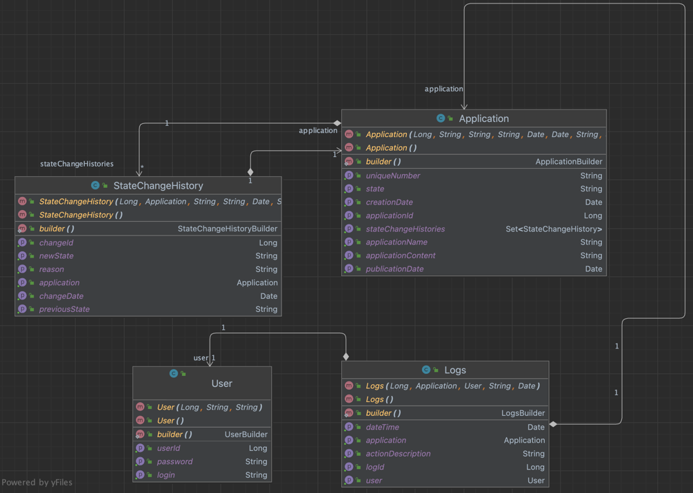

# FlowQuest

## Overview

The Application Management System is designed to facilitate the handling of application submissions. It allows for the
creation, updating, rejection, and deletion of applications. Each application undergoes specific
states (`CREATED`, `VERIFIED`, `REJECTED`, etc.), and the system provides endpoints to manage these transitions
effectively.

## Features

- **List Applications**: Browse through applications with options for pagination and filtering.
- **Create Applications**: Submit new applications with necessary details.
- **Update Applications**: Modify the content of existing applications when they are in `CREATED` or `VERIFIED` states.
- **Reject Applications**: Reject applications by providing a reason, which is recorded for audit purposes.
- **Delete Applications**: Remove applications from the system with a required justification.

## API Endpoints

### List Applications with Pagination

- **GET** `/applications`
- Retrieves a list of applications with support for pagination and optional filtering by name and state.
- Query Parameters:
    - `name`: Filter by application name. (Optional)
    - `state`: Filter by the current state of the application. (Optional)
    - `page`: Request a specific page. Default is 0. (Optional)
    - `size`: Number of records per page. Default is 10. (Optional)
    - `sort`: Sorting criteria in the format: property,(asc|desc). Default is ascending. (Optional)
- Example Request:
    - `/applications?page=0&size=5&sort=applicationName,asc`
    - `/applications?name=Sample&state=CREATED&page=0&size=5&sort=applicationName,asc`

### Create Application

- **POST** `/applications`
- Creates a new application. The request body must include the application name and content.
- Request Body:
  ```json
  {
    "applicationName": "Application Title",
    "applicationContent": "Description of the application."
  }
  ```

### Update Application

- **PUT** `/applications/{id}`
- Updates the content of an existing application. Only allowed if the application is in `CREATED` or `VERIFIED` states.
- Path Variable: `id` - The ID of the application to update.
- Request Body:
  ```json
  {
    "applicationContent": "Updated application content."
  }
  ```

### Reject Application

- **PUT** `/applications/reject/{id}`
- Rejects the application by setting its state to `REJECTED` and recording the reason.
- Path Variable: `id` - The ID of the application to reject.
- Request Body:
  ```json
  {
    "reason": "Reason for rejection."
  }
  ```

### Delete Application

- **DELETE** `/applications/{id}`
- Deletes the application from the system and requires a reason for the deletion.
- Path Variable: `id` - The ID of the application to delete.
- Request Body:
  ```json
  {
    "reason": "Reason for deletion."
  }
  ```

## Installation & Setup

`docker-compose -f src/main/docker/docker-compose.yml up
`

## Testing

tbd..